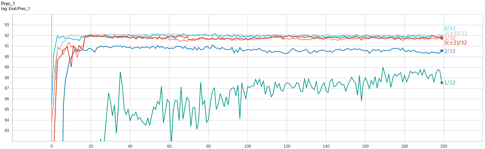
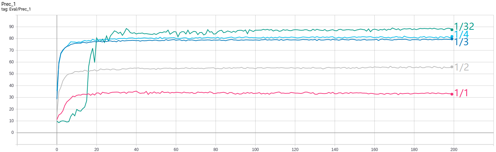

# Experimental Results

We could not replicate the ImageNet experiments due to the limitation of computation power and only finished several experiments based on ResNet-20 and CIFAR-10.

## Full-precision Pre-training

Here are the configuration and performance of our full-precision models: 

| Model     | Dataset  | Epochs |  LR  | LR decay steps (x0.1) | Best Top-1 | Best Top-5 |
|-----------|----------|--------|------|-----------------------|------------|------------|
| ResNet-18 | ImageNet | 120    | 0.1  | 30,60,90              | 69.47%     | 89.04%     |
| ResNet-20 | CIFAR-10 | 200    | 0.1  | 100, 150              | 92.08%     | 99.88%     |
| ResNet-20 | MNIST    | 200    | 0.1  | 35, 100, 150          | 99.38%     | 100.00%    |
| SimpleNet | CIFAR-10 | 200    | 0.1  | 100, 150              | 82.54%     | 99.24%     |

Note:
1. SimpleNet is a simple CNN that we construct for fast validation on CIFAR-10.
2. Implementation of ResNet-20/32/44/56/110/1202 is borrowed from [Yerlan Idelbayev](https://github.com/akamaster)的[akamaster/pytorch_resnet_cifar10](https://github.com/akamaster/pytorch_resnet_cifar10).
3. ResNet-18 is trained on ImageNet while others are trained on CIFAR-10.

## Weight Quantization Training

Here are the configuration and performance of our weight-quantized models:

| Model     | QW     | QA | Epochs |  LR  | LR decay steps (x0.1) | T  | Best Top-1 |
|-----------|--------|----|--------|------|-----------------------|----|------------|
| ResNet-20 | 1      | -  | 200    | 0.1  | 35, 100               | 5  | 89.01%     |
| ResNet-20 | 2      | -  | 200    | 0.1  | 22, 100               | 5  | 91.12%     |
| ResNet-20 | 3(±2)  | -  | 200    | 0.1  | 16, 100               | 5  | 92.03%     |
| ResNet-20 | 3      | -  | 200    | 0.1  | 16, 100               | 5  | 92.08%     |
| ResNet-20 | 3(±4)  | -  | 200    | 0.1  | 16, 100               | 5  | 92.18%     |
| ResNet-20 | 4      | -  | 200    | 0.1  | 15, 100               | 5  | 92.19%     |
| SimpleNet | 1      | -  | 200    | 0.1  | 35, 100, 150          | 10 | 80.87%     |

Note:
1. "QW" denotes the bit-width of weight quantization and "QA" denotes bit-width of activation quantization. "-" denotes no quantization.

The figure above is our weight-quantized ResNet-20's Top-1 curve on CIFAR-10. 
"N/32" denotes N-bit weight quantization and no activation quantization.
"3(±2)" denotes a value range [-2, -1, 0, 1, 2] and "3(±4)" denotes a value range [-4, -2, -1, 0, 1, 2, 4].

## Weight Quantization Training

Here are the configuration and performance of our activation-quantized models:

| Model     | QW | QA | Epochs |  LR  | LR decay steps (x0.1) | T | Best Top-1 |
|-----------|----|----|--------|------|-----------------------|---|------------|
| ResNet-20 | 1  | 1  | 200    | 0.1  | 7, 35                 | 5 | 35.34%     |
| ResNet-20 | 1  | 2  | 200    | 0.01 | 7, 35                 | 5 | 56.48%     |
| ResNet-20 | 1  | 3  | 200    | 0.01 | 7, 35                 | 5 | 78.05%     |
| ResNet-20 | 1  | 4  | 200    | 0.01 | 7, 35                 | 5 | 82.12%     |
| ResNet-20 | -  | 1  | 200    | 0.01 | 7, 35, 100            | 5 | 36.62%     |
| SimpleNet | 1  | 1  | 200    | 0.1  | 35                    | 5 | 70.08%     |
| SimpleNet | 1  | 2  | 200    | 0.1  | 20                    | 5 | 79.02%     |
| SimpleNet | 1  | 2  | 200    | 0.001| 20                    | 5 | 75.73%     |

Note:
1. The activation-quantized model is trained based on the models trained in the previous section. 
Argument "epochs" "LR" are only the parameters in activation quantization training.

The figure above is our fully-quantized ResNet-20's Top-1 curve on CIFAR-10. 
"1/N" denotes 1-bit weight quantization and N-bit activation quantization.